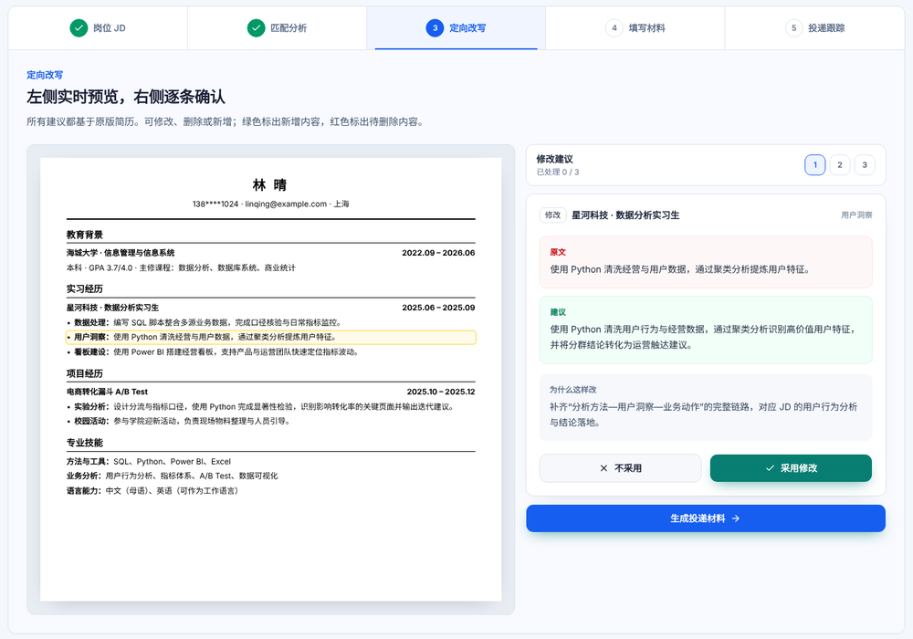
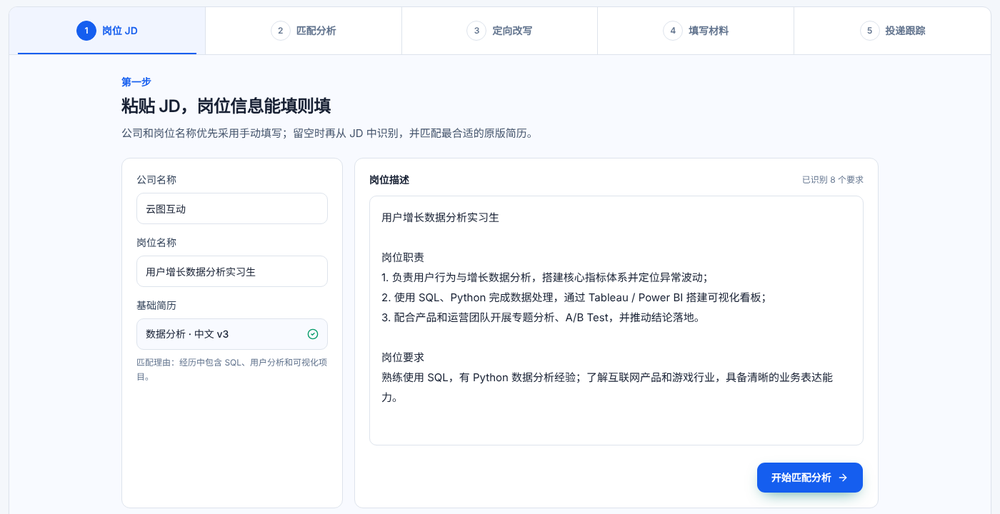
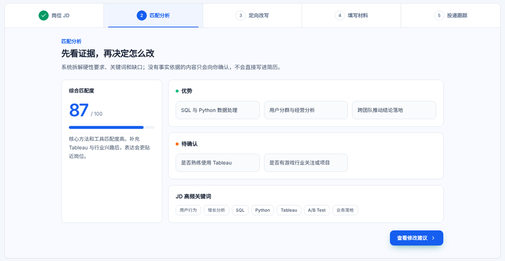
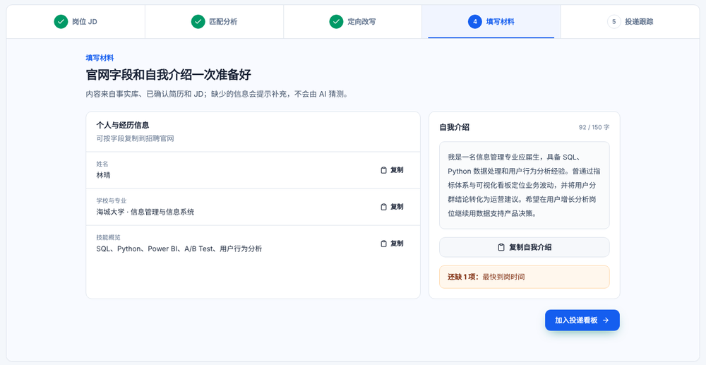
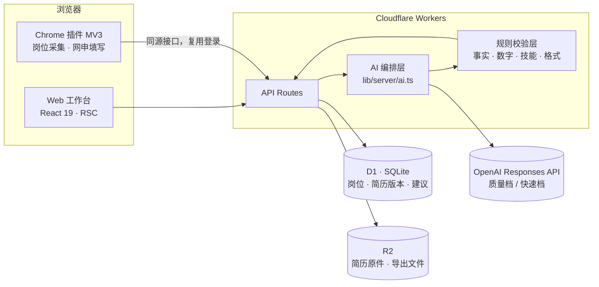

# 秋招速投 · 岗位定向简历工作台

> 粘贴一份 JD，得到一版**只基于真实经历**改写的岗位版简历、官网填写材料和投递记录。AI 负责提建议，所有改动由本人逐条确认。

**[▶ 在线演示（无需登录，约 2 分钟）](https://autumn-job-fast-apply.ddjsgzx.chatgpt.site/demo)**　演示使用虚拟数据，不调用 AI、不保存内容。



## 为什么做这个

秋招时每个岗位都值得一版定向简历，但逐份手工修改非常耗时；直接让大模型改写又很容易“替你编经历”：凭空出现的数字、没用过的工具、被悄悄删掉的原有成果。这个项目要解决的是：**让 AI 帮忙改简历，但绝不让它越过事实边界。**

## 使用流程

| 1. 岗位 JD | 2. 匹配分析 |
| --- | --- |
|  |  |
| **3. 定向改写** | **4. 填写材料** |
|  |  |

1. **岗位 JD**：粘贴 JD 或用 Chrome 插件一键采集，自动识别公司、岗位、地点，并挑选最合适的基础简历。
2. **匹配分析**：拆解硬性要求、加分项和关键词，给出匹配度、优势和**缺口**；没有证据的能力只会列为“待确认”。
3. **定向改写**：逐条给出“原文 → 建议 → 理由”，可采纳、拒绝或先编辑；预览实时标注增删改。
4. **填写材料**：生成官网字段、自我评价、自我介绍、岗位动机和开放题答案。
5. **投递跟踪**：待投递 → 已投递 → 笔试 → 面试 → Offer 看板；导出一页式 PDF、DOCX 和 Overleaf 源码。

## AI 设计：把“不编造”写进代码

提示词里写“不要编造”是不够的，模型仍会偶尔越界。这个项目在提示词之外加了一层**确定性的规则校验**，模型输出的每条建议都要先过校验再展示给用户。核心代码在 [`lib/server/ai.ts`](lib/server/ai.ts)。

**1. 结构化输出 + 双重校验**
所有生成任务都用 OpenAI Responses API 的 `json_schema`（strict 模式）约束输出，再用 zod 二次解析；格式异常自动重试，仍失败则保留现有内容并提示用户，不会写入半成品。

**2. 按任务分层选模型**
改写、匹配、材料生成走质量档模型；从网页提取公司/岗位/地点这类信息抽取任务走快速档模型，降低延迟和成本（[`lib/server/runtime.ts`](lib/server/runtime.ts)）。

**3. 事实护栏（规则层，不依赖模型自觉）**

| 风险 | 校验规则 |
| --- | --- |
| 改写时丢掉原有成果 | 原文中的每个数字、百分比必须出现在改写结果里，否则整条建议作废 |
| 凭空出现新数字 | 改写中出现简历和事实库里都没有的数字，自动标记为“需本人确认” |
| 添加没用过的技能 | JD 要求但没有证据的技能，不会直接写入，而是变成“你是否确实会用 X？”的提问（最多 3 项） |
| “熟悉 / 精通 / 负责过”式夸大 | 新增内容中出现程度词且无事实支撑时，强制转为待确认 |
| 删除或合并原有经历 | 经历和项目禁止 delete / merge，原有要点数量只增不减 |
| 引用不存在的原文 | 每条 replace 的原文必须能在简历中逐字找到，否则丢弃 |
| 跨经历挪用成果 | 事实库追加必须定位到所属经历，且每段经历最多 5 条 |

**4. 生成 → 自检 → 重写闭环**
第一版建议应用到简历副本上，按“泛标题、标题与正文不符、半句式要点、重复标题”打分；不达标时把具体问题反馈给模型重新生成整套建议，**只有分数更好时才替换**。

**5. 隐私与安全**
- 发给模型前自动打码邮箱、手机号、证件号和详细地址；输出中出现占位符的建议直接丢弃。
- 插件采集的网页被标注为“不可信资料”，页面中的任何指令都不会被执行（防提示词注入）。
- API 密钥只在服务端；正式工作台需要登录且仅所有者可访问，数据按用户隔离。

**6. 人始终在环里**
AI 只给建议，不直接改简历；插件只填写，**永不提交**。密码、验证码、协议勾选、文件上传等字段一律留给本人。

## 架构



| 模块 | 位置 |
| --- | --- |
| AI 编排、提示词与校验 | `lib/server/ai.ts` |
| 简历解析（PDF / DOCX，中英文） | `lib/resume-parser.ts` |
| 建议应用与差异对比 | `lib/resume-suggestions.ts` |
| 技能分类合并与去重 | `lib/resume-skills.ts` |
| 事实库与 JD 匹配 | `lib/experience-matching.ts` |
| 官网材料生成 | `lib/server/application-pack.ts` |
| 导出 PDF / DOCX / LaTeX | `lib/resume-export.ts` |
| 使用数据统计 | `lib/server/metrics.ts` |
| 数据表结构 | `db/schema.ts` |
| Chrome 插件 | `chrome-extension/`（说明见其 README） |

## Chrome 插件

在招聘页面一键采集岗位，在网申页面按**字段语义**（标签、ARIA、autocomplete、所在分组）匹配个人档案并填写，兼容 React 受控表单。无法确定的字段默认留空；用户指定一次后，按“域名 + 路径 + 字段指纹”在本机记住。详见 [`chrome-extension/README.md`](chrome-extension/README.md)。

## 使用数据

登录后访问 `GET /api/metrics`，返回当前用户的真实使用统计，口径如下：

| 指标 | 口径 |
| --- | --- |
| 建议采纳率 | 采纳 ÷（采纳 + 拒绝），未处理的不计入 |
| 采纳前改写率 | 被采纳的建议中，用户先编辑再采纳的比例 |
| 待确认占比 | 被校验层标记为“需本人确认”的建议比例 |
| JD → 材料耗时 | 岗位创建到首次生成官网材料包的分钟数（中位数） |
| 投递漏斗 | 待投递 / 已投递 / 笔试 / 面试 / Offer 各阶段数量 |

<!-- 把 /api/metrics 的真实结果填在这里，例如：累计处理 N 个岗位，建议采纳率 X%。 -->

## 测试

```bash
npm test                      # 全部单元测试
npm run test:resume           # 简历解析、技能保留、建议应用
npm run test:extension        # 插件字段语义匹配、AI 图片提取
npm run test:metrics          # 统计 SQL（基于真实迁移文件建库验证）
npm run test:extension:browser  # 在真实 Chrome 中跑插件端到端流程
```

## 技术栈

React 19 · Next.js App Router（vinext / Vite）· TypeScript · Tailwind CSS · shadcn/ui · Cloudflare Workers + D1 + R2 · Drizzle ORM · OpenAI Responses API · zod · pdf.js / mammoth（简历解析）· docx（Word 导出）· 浏览器打印（PDF 导出）· Chrome Extension MV3

## 本地运行

```bash
npm install
cp .env.example .env.local   # 填入 OPENAI_API_KEY 等服务端变量
npm run dev                  # http://localhost:3000，/demo 为演示页
```

部署时在平台配置服务端密钥以及 D1（`DB`）/ R2（`FILES`）绑定。

简历证件照不进入仓库：如需在预览和导出中显示，把照片放到 `public/resume-portrait.local.jpg`（已被 `.gitignore` 忽略）；没有这个文件时会自动省略照片位。

## 开发方式

本项目由我独立设计和维护：需求与产品流程、事实边界规则、各项质量验收标准由我制定；编码过程使用 AI 编程助手（Codex）协作完成，我负责拆解任务、评审每次改动、补充测试并根据真实投递中遇到的问题迭代。
